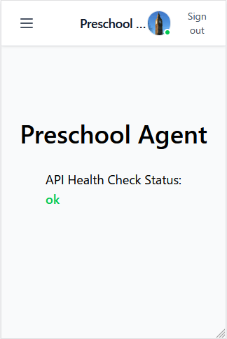
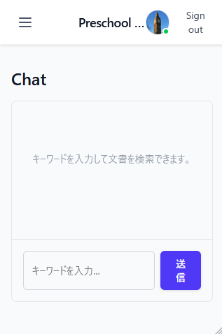
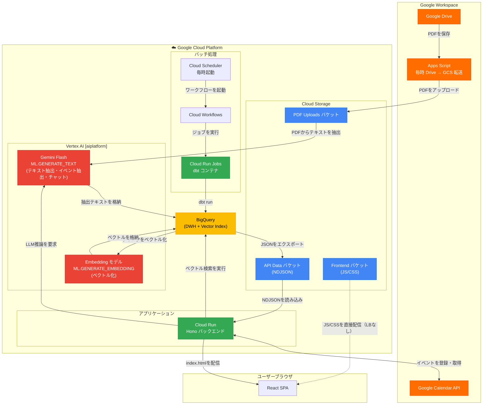
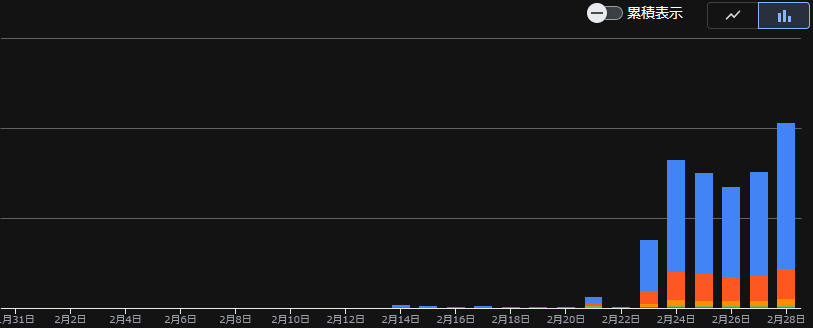

# 幼稚園のめんどいあれこれ
幼稚園のお知らせがPDFでくる。
予定や期限つきで対応が必要なものなどいろいろ。
ばらばらのタイミングで来るので「あの件どこに書いてあったっけ？」がほんとにわからなくなる。
すぐにタスク管理に登録できればよいのだが、割と忘れる。

# 解決の方向性
PDFのテキストデータを解析して以下のような情報の抽出・検索を支援する。

1. 幼稚園の提示する予定を検索できる
2. 幼稚園の提示する予定を任意でカレンダーに登録できる

1の点はせっかくなのでAIエージェントによるエージェンティックサーチに任せるようにしてみる。

# 解決手段
Claude Code Proプランを突っ込む！

# AIエージェントを使うということ
仕事でも使っているけれど、プライベートでも使ってみると学べることもあった。

## 学び1) plan modeで解法を練りきれば割と差分は確認せず放置でもいいやとなる
planを練るのが楽しい。
自分の意図があっているかを十分に検証できる。設計の本質はここかもなーとすら思う。

## 学び2) 詳しいところはツッコめるけど詳しくないところはツッコめない
あたりまえ。
自分はデータパイプラインに関しては言えることがある。
一方でフロントエンド開発に対しては経験が浅い。

するとどうなるか。

- フロントエンドのコードはほぼ雰囲気でマージする。
- データパイプラインのコードやデータモデルはかなり練る。

つまりアプリケーション前提で設計の練度には _かなりの濃淡が出る_ ことになる。
一般にLLMは学習データの分布からTypescriptのコードを上手く書けることは多いらしいので、たまたま今のバランスで困ってない。
というかフロントエンド疎い人はVibe Coding向きなのではとすら思う。

## 学び3) Skiilの使い方はもっと慣れたい
skillはいつどういうタイミングで増やすのかわからん。
意図を的確に実行計画に表現してくれない場合に明確な手順を渡してもっとうまくやってもらうためのものだと理解している。

今のところdbtの設計に関してはある程度の方針があるので、そこをskill化して運用している。

# 成果
React + Viteでスルッと画面ができる驚異。

構成は以下だけど、mermaidレンダリングは後でやります。

# 課題
コストがやばい。

Gemini 2.5 Flashを使っているがThinking Budgetをnon-zeroにしたまま動かしていた。
やってるタスクは幼稚園からもらったPDFからのテキスト抽出なのでThinking絶対いらない。

ということで引き続き調整。
