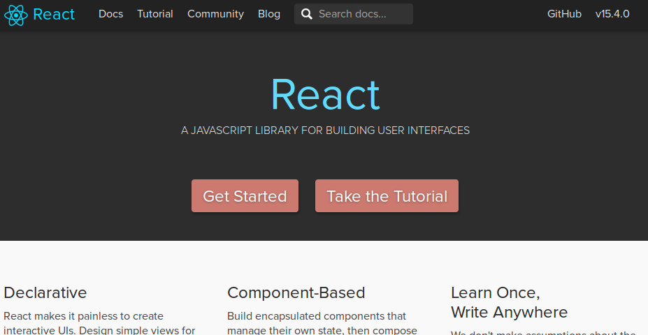

# React導入失敗談

---

## 新技術導入

---

## に失敗してレガシーコードだけが残った

---

## React導入前

- View
- Model

がひとつのファイルの中で入り乱れる

↓

---

↓

巨大な`function`

複数の関数から操作される一つのDOM

---

もうメンテナンスできない

---

## 次期ユーザインタフェース

---

- View操作のプロトコルをReactで固定する
- _Viewのルールが整理できた_

---

## Flux

- DOMイベントのハンドリングとデータ更新のプロトコルをFluxで固定する
- _Modelのルールが整理できた_

---

Viewの秩序 → React

Model(というかViewからのコード分離) → Flux

いけそうな気がした

---

## 導入

---

### 学習過程 - 1

開発ツール＆エコシステムの理解

- webpack: JSのリンカ
- gulp: タスクランナー
- babel: トランスパイラ
- jest or karma: テストランナー

_もうこれだけで正直おなかいっぱいでした_

---

### 学習過程 - 2

基本パターンの理解

- Reactのお約束を理解する
- Fluxのコードを読んでAPIを覚える

＋

- ボイラープレートは切り取って部品にする

---

## いざ実装

......

最初のプロトタイプをいちおう作りきった

---

## 機能拡張とメンテナンス

穴が増えていく

- デザイン上の瑕疵
- エコシステム周りの整備ミス

---

### パッケージデザインのミス

Fluxで機能の役割を整理

→ 役割からはずれた機能を発見

→ 配置するパッケージがわからない

→ とりあえずほとんど`utils`的なところに

_アンチパターン..._

---

### コンポーネントの依存関係のミス

1. データ`A`をHTMLとして描画したい
2. そのためにはデータ`B`が...
3. `B`を構築するには...

_いきあたりばったりwork around..._

---

### ユニットテスト

**開発者自身が不安だと思うところをテストする**

誰がどうみても複雑な関数

_これはまずまず奏功した_

変更時にデグレが見つかるとか

---

### 依存ライブラリと心中 - 1

ローカルではビルド成功

Jenkinsで実行

依存関係の解決でハング

---

### 依存ライブラリと心中 - 2

依存ライブラリのバージョンを固定していない

新たにチェックアウトしてビルドする

→ やっぱり壊れる

バージョン間のAPI非互換がすごい

clean buildするたびにどんどん死んでいく

_くそ、う、動いていたバージョンってどれだ……_

---

### (まとめ)デザイン上の問題

- パッケージデザインのミス
- コンポーネントの依存関係のミス
- どんどん不明瞭になるデータの関係

→  自分で決定するべきアーキテクチャデザインは事前におさえる

---

### (まとめ)エコシステム上の問題

- 依存ライブラリと心中

**ビルドできなくなる** という進化を遂げた

→ エコシステムの不安定さを知っておくべきだった

---

## 教訓

- 技術的な適合だけではだめ
  - メンテナンス
  - エコシステムの使い方
- 使って解る辛さを把握しておく
  - プロダクト特有の癖と付き合うデザイン

---

## 大事なこと

ビジネスサイドのニーズの変化

それに伴って新しい技術を導入するのは良いこと

---

_でも_

---

少しずつ使い始めて少し運用する時間を持つこと

- 小さいプロトタイプを作る
- 社内利用でドッグフーディングする
- _こうした活動に理解のある上司・先輩・同志の支援を受ける_

---

## これから考えたいこと

- 商用サービスに導入するための考慮
- アンテナをはるということ
- 準備のためににいつ学習の時間を作るか
  - 今はReactの思想の源流っぽいElmを触ってる

---

以上

---

Links

[React](https://facebook.github.io/react/)

[Flux](https://facebook.github.io/flux/docs/overview.html#content)
